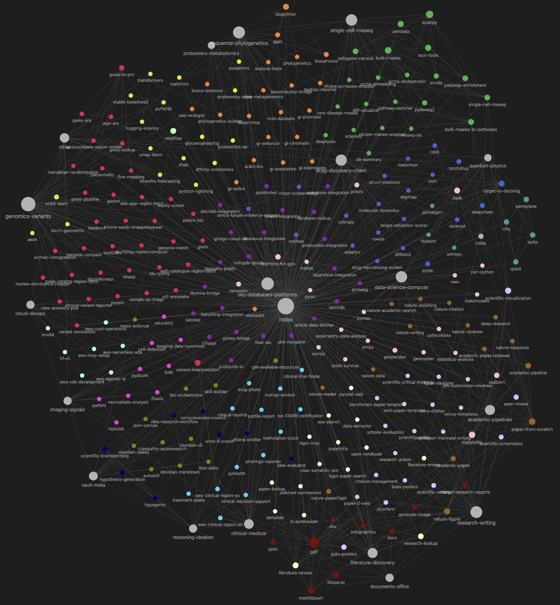
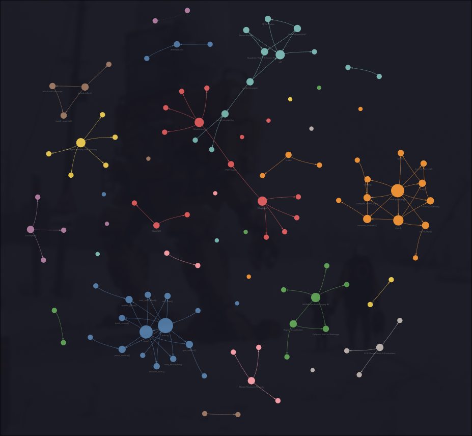

A collection of AI agent skills, organized as an Obsidian vault for easier human navigation.

- managed by vercel's skills
- place at `~/.agents/skills`

## Screenshot
<table width="100%">
  <tr>
    <th>Obsidian graph</th>
    <th>Graphifyy graph</th>
  </tr>
  <tr>
     <td width="50%">
       
     </td>
     <td width="50%">
       
     </td>
  </tr>
</table>

## Setup
```bash
git clone git@github.com:stanfish06/my-skills.git ~/.agent/skills
cd ~/.agent/skills && ./install-skills.sh
```

## Navigation

- **[index.md](index.md)** — start here: all skills grouped into 23 domains, plus an A–Z list.
- **[skills.base](skills.base)** — filterable / sortable table (by domain, status, rating).
- **[recipes/](recipes/index.md)** — goal-oriented workflows that chain skills together.
- **[maps/](maps)** — one map note per domain, with cross-links between domains.
- **[Scientific Expert Profiles](maps/scientific-expert-profiles.md)** — browse the
  discipline index and its per-discipline maps; each lists primary experts first,
  then cross-disciplinary experts, with bridges to broader capability maps.

Each skill has a wrapper note (e.g. `scanpy.md`) at the vault root that links to its
source `SKILL.md`, lists related skills, and holds your personal notes / status / aliases.
The original `*/SKILL.md` folders are never modified, so the skills CLI can manage them
remotely.

## Regenerating the navigation layer

After adding or removing skills, rebuild the wrappers, maps, and index:

```bash
python3 .skill-vault/build.py
```

Your edits are preserved: the `## Notes` section of each wrapper and any `status`,
`rating`, or `aliases` you set in frontmatter survive a rebuild.

Flags:

- `--prune` — delete root wrapper notes whose skill folder no longer exists (only
  touches generated wrappers; hand-written root notes without a `source:` line are kept).
- `--force-aliases` — re-seed aliases from scratch (don't use after curating aliases).
- `--graph` — rewrite the graph filter + per-domain color groups in
  `.obsidian/graph.json`. **Run this with the Graph view CLOSED**, then open it.

The Obsidian graph is filtered (in `.obsidian/graph.json`) to show only the navigation
layer — wrapper, map, recipe, and index notes — so raw files inside skill folders
(`SKILL.md`, `references/*`, scripts) don't appear as isolated nodes, and each domain gets
its own color. To see everything again, clear the search box in Graph view's filter; to
also show each `SKILL.md`, add `OR file:SKILL.md` to that search.

> Note: Obsidian owns `graph.json` while the Graph view is open and re-saves it from
> memory, which can wipe externally-written color groups. If the colors disappear, close
> the Graph view, run `python3 .skill-vault/build.py --graph`, then reopen it. (`build.py`
> without `--graph` never touches `graph.json`.)
