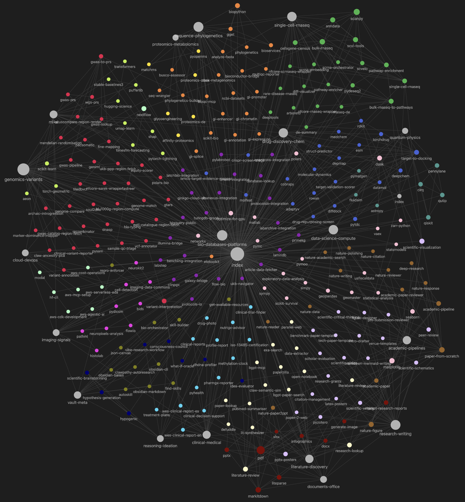

# Skillquarium

A collection of AI agent skills, organized as an Obsidian vault for easier human navigation.

- managed by vercel's skills
- place at `~/.agents` (the repo root _is_ the skills CLI's home; skill folders live in `skills/`)

## Screenshot

<table width="100%">
  <tr>
    <th>Obsidian graph</th>
    <th>Skillquarium TUI</th>
  </tr>
  <tr>
     <td width="50%">
       
     </td>
     <td width="50%">
       
     </td>
  </tr>
</table>

## Setup

```bash
mkdir -p ~/.agents && cd ~/.agents
git init
git remote add origin git@github.com:stanfish06/skillquarium.git
git fetch origin
git checkout -f master
./skillquarium install
```

`install` symlinks every vault skill into each agent's skills folder
(`npx skills add . -s '*' -g`). It needs [Bun](https://bun.sh); the `skillquarium`
launcher installs the CLI's own dependencies on first run.

**gstack**, **career-ops**, and **UI/UX Pro Max** are optional and are
**skipped by default**. Opt in with `--extras`:

```bash
./skillquarium install --extras gstack          # Garry Tan's gstack workflow
./skillquarium install --extras career          # career-ops workspace
./skillquarium install --extras ui-ux           # UI/UX Pro Max seven-skill bundle
./skillquarium install --extras gstack career ui-ux
./skillquarium install --extras all             # all optional extras
./skillquarium install --extras=gstack,ui-ux    # comma form also works
./skillquarium install --help                   # full flag list
```

## Navigation

- **[vault/index.md](vault/index.md)** — start here: all skills grouped by domain, plus an A–Z list.
- **[vault/skills.base](vault/skills.base)** — filterable / sortable table (by domain, status, rating).
- **[vault/recipes/](vault/recipes/index.md)** — goal-oriented workflows that chain skills together.
- **[vault/maps/](vault/maps)** — one map note per domain, with cross-links between domains.
- **[Scientific Expert Profiles](vault/maps/scientific-expert-profiles.md)** — browse the
  discipline index and its per-discipline maps; each lists primary experts first,
  then cross-disciplinary experts, with bridges to broader capability maps.

### Skillquarium TUI

Run the [OpenTUI](https://github.com/anomalyco/opentui) interface from the vault root:

```bash
./skillquarium
```

The launcher requires [Bun](https://bun.sh) and installs the pinned OpenTUI dependency on
first use. It has two tabs, switched with Tab, `1`/`2`, or a click:

- **Skills** toggles model invocation.
- **Benchmarks** lists the skills under evaluation in `eval/skills/`

Keyboard controls (Skills tab):

- `/` focuses search; arrows or `J`/`K` move through results; `M` marks or unmarks the current row.
- `C` toggles Claude Code, `X` toggles Codex, and Space toggles both for all marked rows. With no marks, they affect only the current row. A mixed batch is normalized on; a fully enabled batch is normalized off.
- `F` cycles status filters; `G` cycles categories. Shift reverses either cycle.
- Ctrl-S saves all states; Ctrl-R reloads them; Ctrl-P performs the guarded pre-commit reset.
- `Q` or Esc quits when search is not focused.

The table shows four combined states:

- `enabled` — Claude Code and Codex may both invoke the skill automatically.
- `disabled` — only explicit invocation is allowed in both products.
- `mixed` — the Claude Code and Codex fields disagree; toggling makes both enabled.
- `error` — malformed metadata must be repaired before the tool will change it.

Save writes `.skill-vault/data/skill-toggle-state.json`. Reload reapplies both products
from that snapshot.

The tool writes `disable-model-invocation` in `SKILL.md` for Claude Code and
`policy.allow_implicit_invocation` in `agents/openai.yaml` for Codex.
This prevents skills from loading into agent's context window automatically,
but you can still invoke them manually if needed.

Scriptable commands use the same safe backend:

```bash
./skillquarium list
./skillquarium enable academic-paper atac-seq
./skillquarium enable --product claude academic-paper
./skillquarium disable --product codex atac-seq
./skillquarium disable academic-paper atac-seq
./skillquarium toggle academic-paper
./skillquarium save
./skillquarium load
./skillquarium pre-commit-reset
./skillquarium tui --query "single cell"
```

`./skillquarium -h` lists every subcommand. Beyond the toggles above:
`doctor`, `catalog`, `preview`, `build`, `validate`, `embed`, `tokenizer`, `install`,
`overrides`, `drift`, `soften`, `update`, `import`, `eval`, `query`, `grep`.
Each takes `--help`.

As of 2026-08-09, claude code and pi can reliably toggle skills and
reduce context usage, codex is not working well.
As a workaround, one can use pi as the harness for gpt models.

## Searching the vault

```bash
./skillquarium query "raw fastq to enriched pathways"   # ranked skills, --k N, --json, --explain
./skillquarium grep "AnnData"                           # literal text in skills/, grouped by skill
./skillquarium embed                                    # refresh vault/embeddings/ (committed)
./skillquarium tokenizer                                # retrain vault/tokenizer/tokenizer.json (committed)
```

`embed` needs a llama.cpp `/v1/embeddings` URL in the gitignored `.skill-vault/config.local.json`.
No other command contacts it.

`query` ranks with BM25 over ASCII words (runs of `[a-z0-9]`), then appends up to
`query.bpeExtra` (default 3) skills that BM25 over the committed BPE model's word pieces finds and
that list lacks, tagged `[bpe #N]`. The ASCII list itself never changes; `--no-bpe` or
`bpeExtra: 0` turns the addon off. `tokenizer` retrains the model with
[skill-tokenizer](https://github.com/stanfish06/skill-tokenizer) on PATH or at `tokenizer.bin`;
queries encode in-process and never run the binary.

## Regenerating the navigation layer

After adding or removing skills, rebuild the wrappers, maps, index, and knowledge graph:

```bash
./skillquarium build
```
