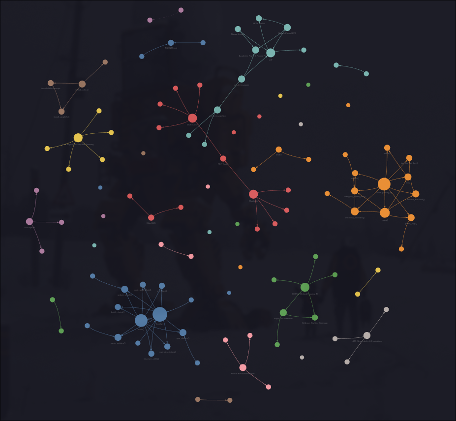

# Skillquarium

A collection of AI agent skills, organized as an Obsidian vault for easier human navigation.

- managed by vercel's skills
- place at `~/.agents` (the repo root _is_ the skills CLI's home; skill folders live in `skills/`)

## Screenshot

<table width="100%">
  <tr>
    <th>Obsidian graph</th>
    <th>Graphifyy graph</th>
    <th>Skillquarium TUI</th>
  </tr>
  <tr>
     <td width="33%">
       
     </td>
     <td width="33%">
       
     </td>
     <td width="33%">
       
     </td>
  </tr>
</table>

## Setup

The repo root is `~/.agents` itself, so the skills CLI finds its canonical
store at `~/.agents/skills` and its provenance lock at `~/.agents/.skill-lock.json`
with no extra wiring. `~/.agents` usually already exists, so init-and-fetch
rather than `git clone` (which refuses a non-empty target):

```bash
mkdir -p ~/.agents && cd ~/.agents
git init
git remote add origin git@github.com:stanfish06/skillquarium.git
git fetch origin
git checkout -f master
./install-skills.sh
```

Default install:

1. Symlinks every vault skill into each agent's skills folder (`npx skills add . -s '*' -g`)
2. Installs / registers [`graphify`](https://github.com/safishamsi/graphify)

**gstack**, **career-ops**, and **UI/UX Pro Max** are optional and are
**skipped by default**. Opt in with `--extras`:

```bash
./install-skills.sh --extras gstack          # Garry Tan's gstack workflow
./install-skills.sh --extras career          # career-ops workspace
./install-skills.sh --extras ui-ux           # UI/UX Pro Max seven-skill bundle
./install-skills.sh --extras gstack career ui-ux
./install-skills.sh --extras all             # all optional extras
./install-skills.sh --extras=gstack,ui-ux    # comma form also works
./install-skills.sh --help                   # full flag list
```

### Optional extras

#### ui-ux (`--extras ui-ux`)

Runs the pinned [`ui-ux-pro-max-cli`](https://github.com/nextlevelbuilder/ui-ux-pro-max-skill)
installer in global universal mode. It generates `ui-ux-pro-max` plus six
companion skills in the vault's canonical `~/.agents/skills` store before the
normal skills CLI propagates them to supported agents. The aliases
`ui-ux-pro-max` and `uipro` are also accepted.

| Env                                   | Effect                                     |
| ------------------------------------- | ------------------------------------------ |
| `UI_UX_PRO_MAX_SKIP=1`                | Force-skip even with `--extras ui-ux`      |
| `UI_UX_PRO_MAX_CLI_VERSION=<version>` | Override the pinned CLI version (`2.14.1`) |

#### career (`--extras career`)

Initializes the complete [`santifer/career-ops`](https://github.com/santifer/career-ops)
workspace at `$HOME/career-ops` and uses its native updater on later runs.

| Env                                 | Effect                                       |
| ----------------------------------- | -------------------------------------------- |
| `CAREER_OPS_DIR=/path/to/workspace` | Change workspace location                    |
| `CAREER_OPS_SKIP=1`                 | Force-skip even with `--extras career`       |
| `CAREER_OPS_AUTO_UPDATE=0`          | Freeze an existing checkout (no auto-update) |

#### gstack (`--extras gstack`)

Pins and runs [garrytan/gstack](https://github.com/garrytan/gstack) with `--prefix`
skill names (`/gstack-qa`, `/gstack-ship`, …) so it does not clobber this vault's
`/qa`, `/review`, `/ship`, etc.

| Env                 | Effect                                                                    |
| ------------------- | ------------------------------------------------------------------------- |
| `GSTACK_SKIP=1`     | Force-skip even with `--extras gstack`                                    |
| `GSTACK_SKIP_BUN=1` | Skip bun install (browser skills disabled; methodology skills still work) |
| `GSTACK_REF=<ref>`  | Pin to a git ref (default is a known-good commit)                         |

## Navigation

- **[vault/index.md](vault/index.md)** — start here: all skills grouped by domain, plus an A–Z list.
- **[vault/skills.base](vault/skills.base)** — filterable / sortable table (by domain, status, rating).
- **[vault/recipes/](vault/recipes/index.md)** — goal-oriented workflows that chain skills together.
- **[vault/maps/](vault/maps)** — one map note per domain, with cross-links between domains.
- **[Scientific Expert Profiles](vault/maps/scientific-expert-profiles.md)** — browse the
  discipline index and its per-discipline maps; each lists primary experts first,
  then cross-disciplinary experts, with bridges to broader capability maps.

### Skillquarium TUI

Run the [OpenTUI](https://github.com/anomalyco/opentui) interface from the vault root:

```bash
./skillquarium
```

The launcher requires [Bun](https://bun.sh) and installs the pinned OpenTUI dependency on
first use. It has two tabs, switched with Tab, `1`/`2`, or a click:

- **Skills** toggles model invocation. Mouse clicks, wheel scrolling, fuzzy search across
  names, descriptions, and categories, and separate Claude Code/Codex switches. Click the
  status and category controls to cycle filters; Ctrl-click cycles backward. Reset returns
  both filters to `all` without changing the search query.
- **Benchmarks** lists the skills under evaluation in `eval/skills/` and the results of a
  saved `eval/runs/<id>/` run: gate pass rate, `skill%` and `full%` for the baseline and
  skill arms with their deltas, and bench numbers in the detail pane. `[` and `]` switch
  runs; the latest is shown first. See [eval/README.md](eval/README.md) for what the
  numbers mean.

Keyboard controls (Skills tab):

- `/` focuses search; arrows or `J`/`K` move through results; `M` marks or unmarks the current row.
- `C` toggles Claude Code, `X` toggles Codex, and Space toggles both for all marked rows. With no marks, they affect only the current row. A mixed batch is normalized on; a fully enabled batch is normalized off.
- `F` cycles status filters; `G` cycles categories. Shift reverses either cycle.
- Ctrl-S saves all states; Ctrl-R reloads them; Ctrl-P performs the guarded pre-commit reset.
- `Q` or Esc quits when search is not focused.

The table shows four combined states:

- `enabled` — Claude Code and Codex may both invoke the skill automatically.
- `disabled` — only explicit invocation is allowed in both products.
- `mixed` — the Claude Code and Codex fields disagree; toggling makes both enabled.
- `error` — malformed metadata must be repaired before the tool will change it.

Save writes `.skill-vault/skill-toggle-state.json` . Reload reapplies both products
from that snapshot. **Activate all** requires a second click or Ctrl-P within five
seconds: it saves the current state, then activates every skill for both products by
dropping the two invocation fields, so what gets committed is the shared default — all
skills on — rather than your personal opt-outs. Only those fields change; unrelated working
edits are left untouched. Reload the snapshot after committing to restore your personal
settings.

The tool writes `disable-model-invocation` in `SKILL.md` for Claude Code and
`policy.allow_implicit_invocation` in `agents/openai.yaml` for Codex.
This prevents skills from loading into agent's context window automatically,
but you can still invoke them manually if needed.

Scriptable commands use the same safe backend:

```bash
./skillquarium list
./skillquarium enable academic-paper atac-seq
./skillquarium enable --product claude academic-paper
./skillquarium disable --product codex atac-seq
./skillquarium disable academic-paper atac-seq
./skillquarium toggle academic-paper
./skillquarium save
./skillquarium load
./skillquarium pre-commit-reset
./skillquarium --query "single cell"
```

Each skill has a wrapper note (e.g. `scanpy.md`) at the vault root that links to its
source `SKILL.md`, lists related skills, and holds your personal notes / status / aliases.
Navigation generation never modifies the original `*/SKILL.md` folders, so the skills CLI
can manage them remotely. `skillquarium` is the deliberate exception: it changes only the
two product invocation fields described above.

As of 2026-08-09, claude code and pi can reliably toggle skills and
reduce context usage, codex is not working well.
As a workaround, one can use pi as the harness for gpt models.

## Regenerating the navigation layer

After adding or removing skills, rebuild the wrappers, maps, and index:

```bash
python3 .skill-vault/build.py
```

Your edits are preserved: the `## Notes` section of each wrapper and any `status`,
`rating`, or `aliases` you set in frontmatter survive a rebuild.

> [!note] Keeping the navigation layer consistent
> The wrappers, maps, and `index.md` are **generated** from the skills on disk, so they
> drift whenever skills are added, removed, or recategorized. Re-run `build.py` (and commit
> its output) as part of any change that touches the skill set — treat a dirty diff after a
> rebuild as a signal that the committed navigation layer is stale. Domain membership is
> currently driven by the hardcoded `CATEGORIES` list in `build.py`; new skills that aren't
> listed there surface under **Uncategorized** (and a `WARNING: not categorized` line), so
> check that output after adding skills. (A future improvement is to derive the domain from
> each `SKILL.md`'s frontmatter, as the expert-persona importer already does.)
>
> `skill-lock.json` is **not** a full manifest — it records only skills installed from a
> remote source (via the skills CLI); locally-authored skills have no lock entry. Don't read
> a missing lock entry as corruption.

Flags:

- `--prune` — delete root wrapper notes whose skill folder no longer exists (only
  touches generated wrappers; hand-written root notes without a `source:` line are kept).
- `--force-aliases` — re-seed aliases from scratch (don't use after curating aliases).
- `--graph` — rewrite the graph filter + per-domain color groups in
  `.obsidian/graph.json`. **Run this with the Graph view CLOSED**, then open it.

The Obsidian graph is filtered (in `.obsidian/graph.json`) to show only the navigation
layer — wrapper, map, recipe, and index notes — so raw files inside skill folders
(`SKILL.md`, `references/*`, scripts) don't appear as isolated nodes, and each domain gets
its own color. To see everything again, clear the search box in Graph view's filter; to
also show each `SKILL.md`, add `OR file:SKILL.md` to that search.

> Note: Obsidian owns `graph.json` while the Graph view is open and re-saves it from
> memory, which can wipe externally-written color groups. If the colors disappear, close
> the Graph view, run `python3 .skill-vault/build.py --graph`, then reopen it. (`build.py`
> without `--graph` never touches `graph.json`.)
