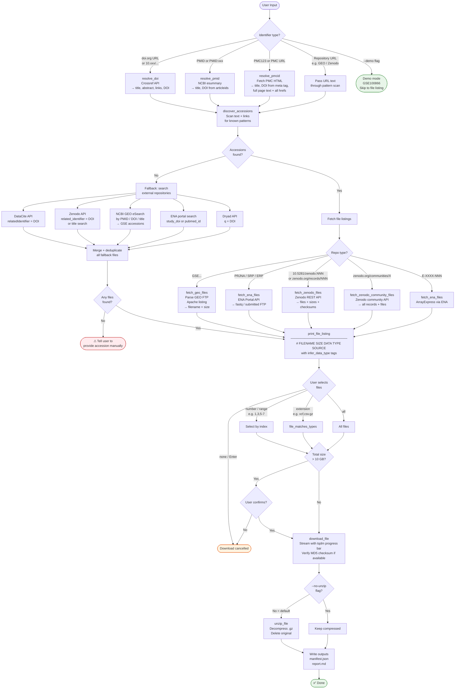

# article-data-fetcher — Workflow Diagram

## Summary of steps

| Step | What happens |
|---|---|
| **1. Parse identifier** | Normalise input → DOI, PMID, PMCID, or URL |
| **2. Resolve article** | Fetch title + DOI + full text from Crossref / NCBI / PMC |
| **3. Discover accessions** | Regex-scan text and hrefs for GEO, ENA, Zenodo, Figshare, Dryad, OSF patterns |
| **4a. Fetch file listings** | Hit repository APIs to get filename, size, URL, checksum |
| **4b. Fallback search** | If no accessions found, query DataCite, Zenodo, GEO, ENA, Dryad by DOI/title |
| **5. Tag data types** | Keyword rules infer `count matrix`, `metadata`, `variant calls`, etc. |
| **6. User selects files** | By number, range, extension, or `all` |
| **7. Download** | Stream with progress bar, verify MD5, auto-unzip `.gz` by default |
| **8. Write outputs** | `manifest.json` (paths + checksums) and `report.md` |
