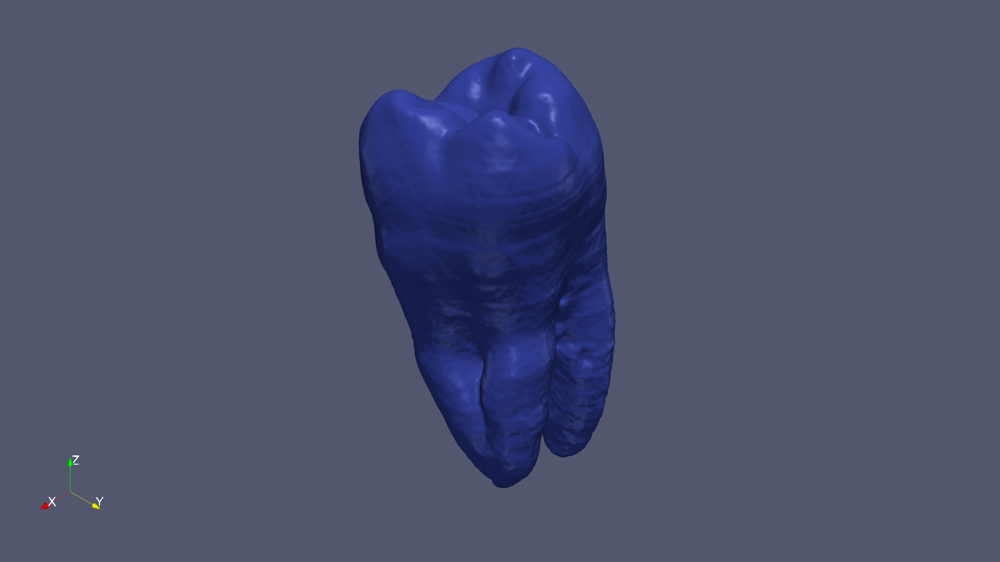
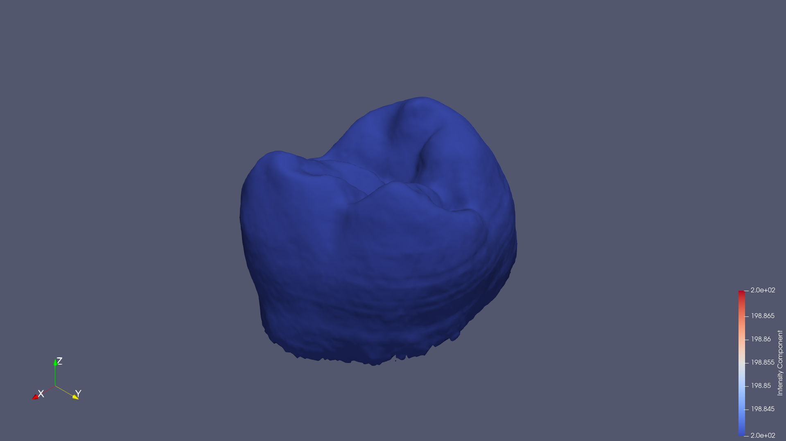

# ParaView Skills


Agent skills for scientific visualization with ParaView. These skills trying to enable Claude CLI to help you create and manipulate 3D scientific visualizations including volume rendering, isosurfaces, streamlines, and more.


## Prerequisites

- [ParaView](https://www.paraview.org/download/) 5.10+ installed
- Python 3.10+
- [Claude Code](https://docs.anthropic.com/en/docs/claude-code) CLI

## Installation

### Quick Install

```bash
# Link your local clone into Claude Code skills directory
ln -s "$(pwd)" ~/.claude/skills/paraview
```

### Manual Install

1. Download or clone this repository
2. Copy to `~/.claude/skills/paraview/`
3. Ensure the directory structure looks like:


## Configuration

Set the `PARAVIEW_HOME` environment variable to point to your ParaView installation:

```bash
# Add to ~/.bashrc or ~/.zshrc
export PARAVIEW_HOME=/path/to/ParaView-5.12.1

# Example paths:
# Linux: /opt/ParaView-5.12.1
# macOS: /Applications/ParaView-5.12.1.app/Contents
# Windows: C:\Program Files\ParaView 5.12.1
```


## Example Case: Tooth Isosurface Visualization

This example demonstrates using Claude Code with the ParaView skill to visualize a RAW volume dataset.

### Prompt 1: Initial Isosurface Rendering

**User:**
> Can you visualize this volume `/path/to/tooth_103x94x161_uint8.raw` with iso-surface rendering? Save the rendering as `tooth_isosurface.png`


**Result:**



### Prompt 2: Adjust Isovalue for Half Surface Area

**User:**
> Can you choose a good isovalue that only have half surface of this rendering `/path/to/tooth_isosurface.png`?


**Result:**




## Acknowledgments

- [ParaView](https://www.paraview.org/) - Open-source scientific visualization
- [Claude Code](https://docs.anthropic.com/en/docs/claude-code) - AI-powered coding assistant
- [ParaView MCP](https://github.com/llnl/paraview_mcp) - ParaView Model Context Protocol server by LLNL
- [ChatVis](https://github.com/tanwimallick/ChatVis/) - LLM-based scientific visualization generation
