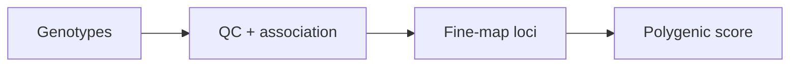

# GWAS → polygenic risk

> [!abstract] Goal
> Go from genotypes to association hits, fine-mapped credible sets, and polygenic risk scores.

[Back to Recipes](index.md)  ·  [Skill Index](../index.md)

## Pipeline

## Steps

1. **[gwas-pipeline](../gwas-pipeline.md)** — PLINK2 genotype QC + REGENIE whole-genome association (Manhattan / QQ / lead variants).
2. **[fine-mapping](../fine-mapping.md)** — SuSiE credible sets and posterior inclusion probabilities for causal variants.
3. **[gwas-prs](../gwas-prs.md)** — polygenic risk scores from the PGS Catalog. From raw WGS instead: **[wgs-prs](../wgs-prs.md)**.

## Explore & validate

- **[gwas-lookup](../gwas-lookup.md)** — federated variant lookup across GWAS Catalog, Open Targets, GTEx, etc.
- **[locuscompare-region-render](../locuscompare-region-render.md)** — confirm two signals share a causal variant.
- **[mendelian-randomisation](../mendelian-randomisation.md)** — causal inference from summary stats.
