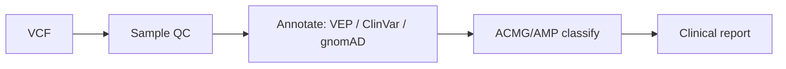

# Germline variant interpretation

> [!abstract] Goal
> Take a VCF to an annotated, ACMG/AMP-classified, ranked clinical report.

[Back to Recipes](index.md)  ·  [Skill Index](../index.md)

## Pipeline

## Steps

1. **[sample-qc-triage](../sample-qc-triage.md)** — identity, sex, contamination, batch-shift checks (optional but recommended).
2. **[vcf-annotator](../vcf-annotator.md)** — Ensembl VEP + ClinVar + gnomAD annotation and impact ranking. Alternative: **[variant-annotation](../variant-annotation.md)**.
3. **[clinical-variant-reporter](../clinical-variant-reporter.md)** — ACMG/AMP 2015 classification with per-variant evidence.
4. **[wes-clinical-report-en](../wes-clinical-report-en.md)** — clinical PDF report. Spanish: **[wes-clinical-report-es](../wes-clinical-report-es.md)**.

## Add-ons

- **[pharmgx-reporter](../pharmgx-reporter.md)** — pharmacogenomic findings.
- **[clinical-trial-finder](../clinical-trial-finder.md)** — matching trials for a gene/variant/condition.
- Low-level VCF/BAM handling: **[pysam](../pysam.md)**.
